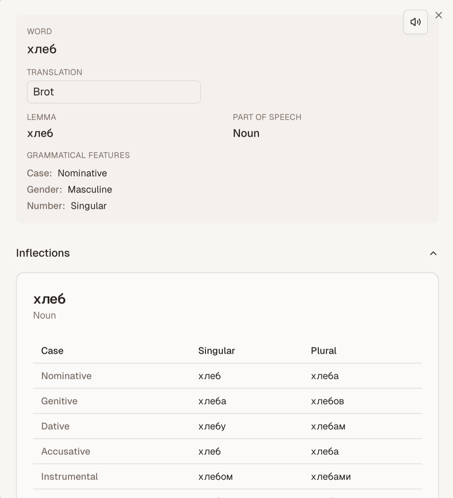

## Building cool stuff

I really enjoy building things. Building things is easy. Building something that people are interested in is hard.
Getting through the amount of AI slop that everybody is pumping out right now and building something you genuinely
believe in is even harder.
However, I recently finished an MVP of my first product that I think might bring genuine value to people.
It has been coded with the assistance of AI, but real engineering work has gone into it, and there are components and
concepts that I think other engineers might be interested in, which is the reason this is a blog post and not just
a tweet. Let me show you!

## grammr

I am fascinated by languages. I would like to learn more of them, but learning them as an adult is difficult and takes time.
I wish I had started learning more languages when I was twelve: Your brain is easier to mold, and you simply _have more time_.
I recently started learning Russian for my fiancée, and it's been ... challenging.

So instead of actually learning the language with tools like Duolingo and Babbel, I invested dozens, if not hundreds of hours
into building the perfect language learning tool to help me learn Russian. Time well invested!

What grammr does that other platforms don't is that it gives you a highly systematic approach to learning.
Russian is a "[fusional language](https://en.wikipedia.org/wiki/Fusional_language)", which means that you get base forms
of words that are modified to convey grammatical, syntactical or semantic features. If you've studied Latin in school,
this is something you're familiar with: It comes in the form of conjugation and declension tables, among other things.

Duolingo gives you sentences to study, but it provides you with a very limited knowledge of _why_ sentences are structured the way they are.
I've attempted to rectify that: You can translate and study sentences, and when you do, you can click each word to get a detailed breakdown
of each word. 

I've used [spaCy](https://spacy.io), a popular Python-based NLP library under the hood to facilitate a deeper understanding
of the underlying syntax and grammar (thus the name of the website).

You can store sentences and individual words as flashcards, which you can study using the FSRS (free spaced repetition scheduler) algorithm.

If you're interested in language learning, it'd mean the world to me if you tried it out and provided some feedback. I've made it as
easily accessible as possible. Check it out here: [grammr.app](https://grammr.app).

## Engineering

Now for the part I _really_ enjoy. I'll be honest with you: I'm not convinced this is a product people are going to want to use (yet).
I'm hoping to maybe find a niche community, but I doubt this will ever find mainstream appeal. That being said, the engineering side of things
has been really enjoyable.

### Conjugation & Declension Tables

One of the first things people ask me when I show them conjugation and declension tables is: "Where do you get the data"?
A comparable project to this is [openrussian.dev](https://en.openrussian.org), who kindly open-sourced their database.
They sourced their inflections (i.e. conjugations & declensions) from Wiktionary and stored them in a database, which is completely valid. 
I took a bit of a different approach.

Instead, I sourced multiple specialized libraries that can create inflections for various languages. Specifically, there is
[pymorphy3](https://github.com/no-plagiarism/pymorphy3) for Russian, as well as [verbecc](https://github.com/bretttolbert/verbecc)
for verbs of the Romance language family. I currently maintain Italian, French, Portuguese and Spanish inflection services as those
are the most commonly spoken and learned languages of this family.

I then defined a common data structure that all these map to. I've defined an [OpenAPI Spec](https://github.com/twaslowski/grammr-serverless/blob/main/lambda/inflections-ru/openapi.yaml) with the data format that all inflection services
are expected to return. They use [universal features](https://universaldependencies.org/u/feat/index.html), which is the most commonly used NLP
standard I could identify. This allows for easy extension of the inflection services; for example, English could be added trivially using the popular
[inflect](https://pypi.org/project/inflect/) library. Since writing this code, I've also discovered the [pyinflect](https://pypi.org/project/pyinflect/) project which might be worth looking into.

I believe this might be of interest to the NLP community, as it provides a simple, standardized and extensible REST interface for retrieving inflections for various language.

### The Serverless Stack: Learning from previous iterations

This is actually the third iteration of this project. The first iteration was deployed as a Telegram bot that you could forward sentences in any language to. I soon rejected this design based on the fact that it was too limited in displaying complex information.

In the second iteration, I decided to built a core service using Java and Spring Boot, which is my professional stack and which I decided might be better at handling complex domain logic. I ran the NLP components as Flask-based webservers and orchestrated deployments in a k3s server running at home. I ended up rejecting this architecture for multiple reasons:

1. **Language sprawl**: Domain objects had to be maintained across three tiers in three languages: The Python-based NLP services, the Java-based core service as well as the Typescript frontend. This led to a lot of duplication. I briefly looked into centralized gRPC type definitions, but decided that the effort was not worth it.
2. **Hosting effort**: Hosting the variety of web services turned out to be a lot of effort; maintaining uptime in a fragile homelab turned out to be difficult, with large deployments regularly crashing because I had to pull various images concurrently frequently around ~1GB in size due to model weights. The namespace would consume several GBs of RAM, and maintaining a staging and production environment turned out to be extremely expensive and tedious.
3. **Bad design**: I approached this iteration as an engineer with no product thinking. I did not scope the product properly, leading to me trying to support every usecase under the sun. I did not require users to sign in, which led to me having to hop through various loops supporting anonymous users with no language preferences, performing language detection, writing an `AnonymousUserFilter` based on ad-hoc session cookies and more things that did not actually help me identify whether or not anybody was interested in the product. Also, this was the first time I built my own frontend, my first experience with NextJS, and it was just ... bad.

This iteration has been incredibly fun to work with, even as it grows. Learning from my first two failed iterations, I made a lot of correct assumptions in the beginning, leading to very solid design.

The most central part of this design is using the very standard AWS API Gateway + Lambda stack for the compute-intensive, Python-based NLP tasks, and doing everything else in NextJS, deployed on Vercel. Lambda code is dockerized, with medium-size models chosen to achieve ~300Mb images to achieve an acceptable trade-off between relatively quick cold-start times and sufficient accuracy.

Absolutely everything is managed in Terraform: The Vercel projects, its environment variables, the domains; all AWS resources, and even the Supabase project.

### No CI/CD: Pragmatic DevOps

I actually have not built any CI. The most common component I deploy is the frontend, which is connected to Vercel. This gives me continuous deployment out of the box. For my Lambdas, I have build scripts to create and push images when I make changes. I use Taskfile to apply Terraform changes by running `task apply:prod` or `task apply:dev`. I firmly believe that for this stage of the project, investing the time to get a mature CI/CD set up would be overkill. My professional background is that of a DevOps engineer, so this may seem like a very unconventional choice, but I fully stand behind it. As a matter of fact, I believe this conscious choice to be a sign of my increasing maturity as an engineer, realizing that rules can sometimes be broken.

### Supabase: The good, the bad, the ugly

The previous iteration used a self-hosted Postgres instance for storage and Clerk for authentication. This time around, I used Supabase to consolidate those essential features. And I gotta say: I love it. It's a great product. But I would be remiss to not point out its shortcomings.

**The Good**: Even the free tier gives you a lot. Up to 100k users, sufficient storage for an MVP, uncomplicated ways to access the database. There are various features I have not used and likely will not be using: For instance, if I were to store audio blobs, I probably would do so with S3, a Lambda and an additional API Gateway endpoint to be

## Outlook

I've enjoyed building this project. Even if it does not go anywhere, it is a very fun exercise in product thinking, in architecting and building, and I might end up building just for myself if nobody else wants to use it. If you've made it here, I still encourage you to check it out at [grammr.app](https://grammr.app)!