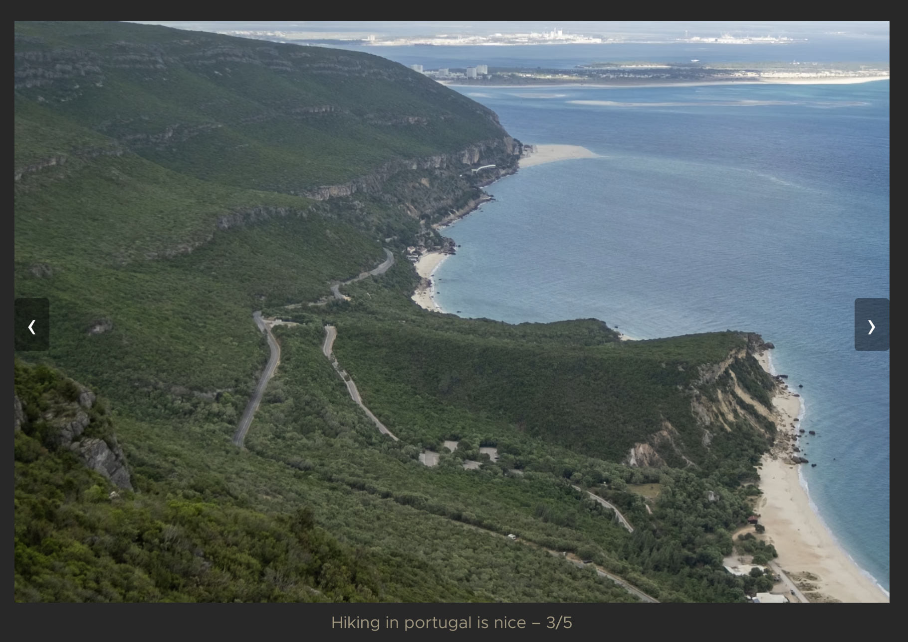

## Preface: On my personal circumstances

I recently became a digital nomad. Being a creative person, I always have to have a creative hobby.
What exactly that is varies: Sometimes it is music, other times I code a project in my free time.
Because I could not carry my music gear with me, and I did not want to rely on coding as my sole creative
hobby (because I get tired of staring at my IDE at work **and** in my free time), I decided to get into
photography, which has been an interest of mine for a few years now.

After the first few weeks, I felt like I had to do something with the pictures though: If I just let
them rot on my hard drive, I would not be particularly inspired. As with my music, I have to post the
results of my work somewhere for people to see, even if it is far from perfect. So I decided to set up
a blog. It would double as an exercise in writing, which is a skill I am trying to cultivate. As knowledge
workers, I believe we have to resist the urge of leaving everything to AI – articulating our thoughts clearly
is a part of our job, after all, even if we are just articulating our thoughts to LLMs.

I looked at a few different options – hosting a WordPress blog, or running one of several applications on a VPS.
I could have signed up with a bunch of services. I seriously considered Substack as an option, but did not like
that it is text-first, and there is only so much you can do with images. It might still be worthwhile because
it allows you to get discovered and has a range of useful features, but I figured I'd like something more ...
customizable.

So I figured that really, a blog just consists of some HTML and the images. I have experience with
static site generators like Jekyll (which is powering this blog), and I was already backing up my images
to Backblaze B2, so I started thinking ... how difficult could it be to build my own blog?

## Building a Blog

I wanted a technology that allows me to write pages in Markdown, apply a nice theme and publish the resulting
page to GitHub Pages. I'm using Jekyll for this blog, but it is somewhat limited.

When I started searching for other static site generators, I came
across [Hugo](https://gohugo.io/). Hugo also seems popular for documentation, which got me thinking that learning
it might be a solid investment in my future – who knows, I might use it professionally one day.

So I'm using Hugo to generate HTML. I can host this HTML on GitHub Pages with ease. I can set up DNS on Cloudflare
at my twaslowski.com domain. And it turns out that Backblaze B2 and Cloudflare have a
[partnership](https://www.backblaze.com/docs/cloud-storage-deliver-public-backblaze-b2-content-through-cloudflare-cdn)
so that egress is free.


### The Infrastructure

I'm a DevOps engineer by trade, so my first action item was setting up Terraform and opening up the docs for
the Cloudflare and B2 providers. This turned out to be easy.

#### Setting up Storage

I already had B2 set up to back up my RAW files. I had `rclone` configured, so all I needed was a new, public
bucket with reasonable CORS configuration.

```hcl
resource "b2_bucket" "photos" {
  bucket_name = var.b2_bucket_name
  bucket_type = "allPublic"

  cors_rules {
    cors_rule_name = "allow-blog"
    allowed_origins = [
      "https://photography.twaslowski.com",
    ]
    allowed_headers = ["*"]
    allowed_operations = ["s3_head", "s3_get"]
    max_age_seconds = 3600
  }
}
```

#### Setting up DNS

We'll need two different records: One to serve the actual blog, which will be hosted at `photography.twaslowski.com`,
and then another one for all the CDN tasks (at `img.twaslowski.com`). Here's the code:

```hcl
resource "cloudflare_dns_record" "pages" {
  zone_id = var.cloudflare_zone_id
  name    = "photography"
  type    = "CNAME"
  content = "twaslowski.github.io"
  proxied = false
  ttl     = 3600

  comment = "managed-by:terraform;application:photo-gallery"
}

resource "cloudflare_dns_record" "images" {
  zone_id = var.cloudflare_zone_id
  name    = "img"
  type    = "CNAME"
  content = "f003.backblaze.com"
  proxied = true
  ttl = 1 # auto when proxied

  comment = "managed-by:terraform;application:photo-gallery"
}
```

Note the `comment` field. Always tag your cloud resources, kids! Also, of course the subdomains are parameterized.
This is just for the sake of illustration. And that's the essential infra!

#### Transform Rule

You also should set up a Cloudflare transform rule. Everything _works_ without a transform rule,
but this allows bad actors to serve untrusted content through your domain. Consider this URL structure:
`https://img.twaslowski.com/photos-web-prod/portugal/hike-1.avif`.

It just consists of my CDN subdomain (`img.twaslowski.com`), the bucket name (`photos-web-prod`) and then a file path.

Do you see the problem? A bad actor could create a bucket called `bad-photos` and serve arbitrary files
under my subdomain if I'm not careful! Something like
`https://img.twaslowski.com/bad-photos/a-very-pad-photo.jpg` could now easily resolve to a malicious file
in a bucket I do not control.

The folks at Backblaze have documented this problem and the solution very well, and you can find that article
[here](https://www.backblaze.com/docs/cloud-storage-deliver-public-backblaze-b2-content-through-cloudflare-cdn#configure-a-transform-rule)
if you're interested.

Essentially, to remediate this problem we'll have to set up a transform rule to ensure that all calls to
`img.twaslowski.com` automatically resolve to the bucket I control.

```hcl
resource "cloudflare_ruleset" "bucket_rewrite" {
  phase = "http_request_transform"

  rules = [
    {
      expression = "(http.request.full_uri wildcard r\"https://img.twaslowski.com/file/*\")"

      action = "rewrite"
      action_parameters = {
        uri = {
          path = {
            expression = "wildcard_replace(http.request.uri.path, r\"/file/*\", r\"/file/${var.b2_bucket_name}/$${1}\")"
          }
        }
      }
    }
  ]
}
```

Now, a URL like `https://img.twaslowski.com/file/portugal/pt-12.avif` internally gets rewritten
to the bucket of my choosing. No more bucket injection!

#### Caching

I use Cloudflare to aggressively cache images at the edge. All content served from `img.twaslowski.com` is cached for a
month, given that the status code of the initial request is 200.

```hcl
resource "cloudflare_ruleset" "cache_images" {
  phase = "http_request_cache_settings"

  rules = [
    {
      expression = "(http.host eq \"img.twaslowski.com\")"
      action     = "set_cache_settings"

      action_parameters = {
        edge_ttl = {
          mode    = "override_origin"
          default = 7 * 24 * 3600

          status_code_ttl = [
            {
              status_code = 200
              value       = 7 * 24 * 3600
            },
            {
              status_code = 404
              value       = 0
            }
          ]
        }
      }
    }
  ]
}
```

Specifying status codes is important here! I initially misconfigured this and cached some 404s.
I had a very bad time debugging this and ultimately had to clear my cache via the Cloudflare REST API.
That's two hours of my life I'm not getting back.

### Static Site Generation

I would just like to say: Hugo is **very powerful**. It mixes HTML + CSS, JS and the Go template language.
The Go template language is a different beast entirely that I have strong opinions on which I won't get into today.
If you're interested in more reading, I recommend this brilliant article:
[Every Simple Language Will Eventually End Up Turing Complete](https://solutionspace.blog/2021/12/04/every-simple-language-will-eventually-end-up-turing-complete/).

I've coded a few projects with NextJS and have kind of grown to like TypeScript. I was considering building a project
on this stack and hosting it on Vercel, but I felt like doing something simple for once.

But then I tried doing some more powerful things, like implementing a carousel. What is about to follow is
purely my fault. Brace yourself.



````html

<div class="carousel-track" style="position:relative; width:100%;">
    {{ range $i, $img := $images }}
    <div class="carousel-slide" data-index="{{ $i }}"
         style="transition:opacity 0.3s; {{ if $i }}opacity:0; position:absolute; top:0; left:0; width:100%; pointer-events:none;{{ else }}opacity:1; position:relative; width:100%;{{ end }}">
        {{ if $i }}
        {{ partial "image.html" (dict "src" (printf "%s%s" site.Params.imageBaseURL (strings.TrimSpace $img)) "alt"
        $alt "style" "width:100%;" "datasrc" true) }}
        {{ else }}
        {{ partial "image.html" (dict "src" (printf "%s%s" site.Params.imageBaseURL (strings.TrimSpace $img)) "alt"
        $alt "style" "width:100%;" "eager" true) }}
        {{ end }}
    </div>
    {{ end }}
</div>
````




If you did not read that in its entirely, I don't blame you. Mixing the Go templating language and HTML
is the most [blursed](https://www.urbandictionary.com/define.php?term=Blursed) thing I've seen in a while.
It is incredibly powerful, but I've seen some truly unspeakable things.

The above is the implementation of a carousel, where you can cycle through a selection of images.
It is invoked as follows:



````html

````



That results in the following:



With extensive help of LLMs (obviously, what sane person what write this stuff on their own?) I managed
to get a healthy selection of macros ([shortcodes](https://gohugo.io/templates/types/#shortcode)
and [partials](https://gohugo.io/templates/types/#partial), in Hugo terms) that handle image loading and displaying with
a healthy bit of optimization. They are easy enough to use that dealing with their maintenance every
once in a while is not so bad.

## Wrapping up

This is honestly a super fun project that I've enjoyed working on a lot. There's a bunch of stuff I haven't even
gotten into yet:

- There is a custom theme, which you can find at [twaslowski/newsroom](https://github.com/twaslowski/newsroom). Instead
  of the plain old black and white, the light mode theme is based on Solarized and the dark mode theme on Gruvbox.
- Also, the shortcodes and partial system is quite powerful, and I really enjoy working with it, despite my complaints
  about the syntax above. I have abstracted away a lot and encapsulated a bunch of small performance hacks, like using
  `srcset`, that make it very easy to work on the website.
- There is a bunch of tooling around resizing and uploading images. For example, there is a `resize` command that
  generates resized images using [ImageMagick](https://imagemagick.org) and a `sync` command that syncs my images
  directory to B2 using [rclone](https://rclone.org/). Good tooling is important!

I believe that's it. 
